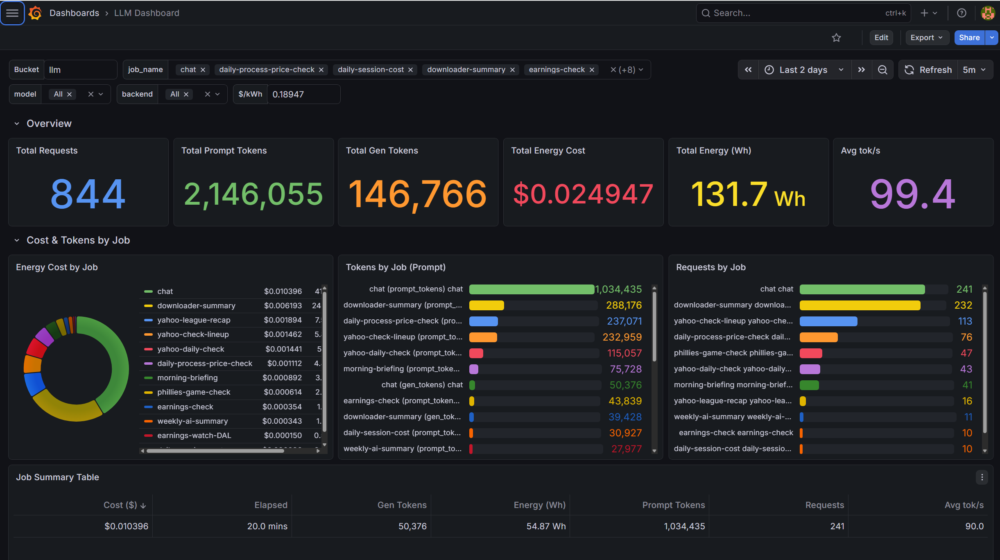
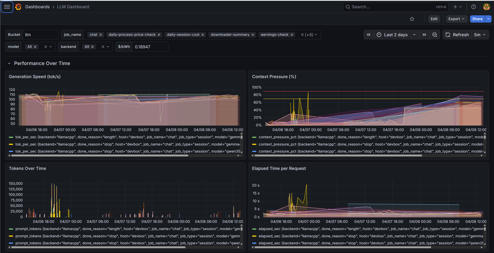
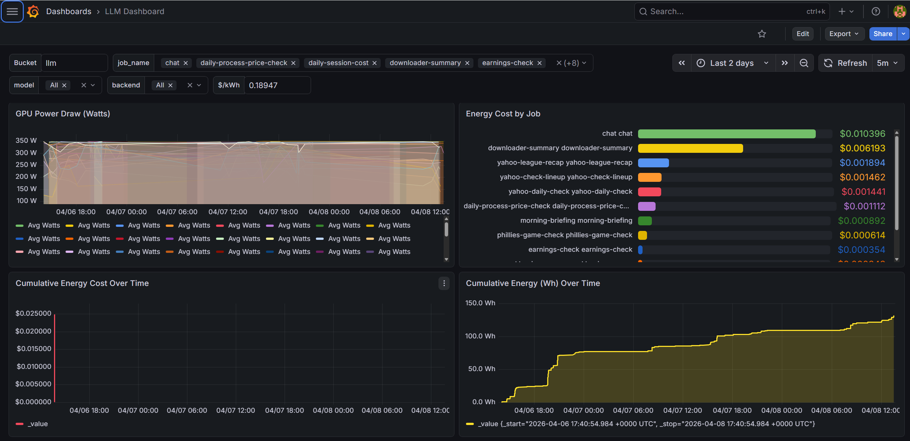
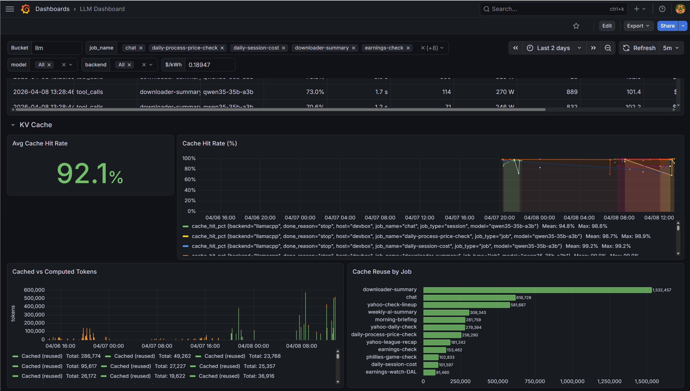

# LLM Stuff

Tooling for working with local LLM instances (Ollama, llama.cpp).

## Debug Proxy (`proxy.js`)

A zero-dependency Node.js HTTP proxy that sits between your client and an LLM backend, logging request/response details with colored terminal output. Supports both Ollama and llama.cpp backends.

### Quick start

```bash
# Ollama mode (default) — proxy on :11434, backend on :11435
node proxy.js

# llama.cpp mode — proxy on :8080, backend on :8081
node proxy.js --backend llamacpp
```

For Ollama mode, you must configure Ollama to listen on port **11435** so the proxy can take over the standard 11434 port. Clients need no reconfiguration.

### Output modes

Pick one (mutually exclusive):

| Flag | Behavior |
|------|----------|
| `--buffer-thinking` | Reassemble thinking tokens into larger blocks before logging **(default)** |
| `--filter-thinking` | Suppress thinking chunks from log output entirely |
| `--raw` | Print every raw JSON chunk as-is |

### Options

| Flag | Description |
|------|-------------|
| `--backend ollama\|llamacpp` | Force backend mode (default: auto-detect from port) |
| `--proxy-port N` | Override proxy listen port |
| `--backend-port N` | Override backend port |
| `--dump-messages` | Print the full messages array from each request |
| `--dump-request` | Print the full transformed request body (params + all messages) |
| `--message-size N` | Max chars per message preview (default: 300, 0 = no limit) |
| `--default-ctx N` | Fallback context size for context-pressure calculation |
| `--thinking` | Inject `think:true` into requests (default: injects `think:false`) |
| `--debug-labels` | Dump first user message for job-label tuning |
| `--log-file [path]` | Append `[done]` summary lines to a file (default: `./proxy-done.log`) |
| `--power` | Enable GPU power monitoring and energy cost tracking |
| `--power-provider path` | Path to power provider module (default: `./power-nvidia-smi.js`) |
| `--electric-rate N` | Electricity rate in $/kWh (default: 0.18947) |
| `--gpu-idle N` | GPU idle watts to subtract for incremental cost (default: 0) |
| `--power-interval N` | Power sampling interval in ms (default: 1000) |

### InfluxDB Logging

The proxy can write per-request metrics to InfluxDB for long-term storage and dashboarding.

| Flag | Description |
|------|-------------|
| `--log-mode M` | Logging mode: `file` \| `influxdb` \| `none` (default: `none`) |
| `--influxdb-url URL` | InfluxDB server URL (or env `INFLUXDB_URL`) |
| `--influxdb-org ORG` | InfluxDB organization (or env `INFLUXDB_ORG`) |
| `--influxdb-bucket B` | InfluxDB bucket (or env `INFLUXDB_BUCKET`) |
| `--influxdb-token T` | InfluxDB auth token (or env `INFLUXDB_TOKEN`) |

Each completed request writes a point to the `llm_request` measurement with tags for backend, model, job type/name, and hostname, plus fields for tokens, timing, context pressure, cache hit rate, GPU power, and energy cost.

```bash
# Example: proxy with InfluxDB logging and GPU power tracking
node proxy.js --power --log-mode influxdb \
  --influxdb-url http://nas:8086 \
  --influxdb-org myorg \
  --influxdb-bucket llm \
  --influxdb-token mytoken
```

### Grafana Dashboard

Import `grafana-llm-dashboard.json` into Grafana to visualize proxy metrics stored in InfluxDB. The dashboard has four sections:

#### Overview



High-level stat panels (total requests, prompt/gen tokens, energy cost, average tok/s) and per-job breakdowns by cost, tokens, and request count. A Job Summary Table provides a single-glance comparison across all active jobs. Use this to understand workload distribution and spot which jobs consume the most resources.

#### Performance Over Time



Time-series charts for generation speed (tok/s), context pressure (% of context window used), token volume, and elapsed time per request. Use this to identify performance regressions, detect when context windows are filling up, and correlate slowdowns with token volume spikes.

#### GPU & Energy



GPU power draw over time, energy cost broken down by job, and cumulative energy/cost trend lines. Use this to monitor GPU utilization patterns, compare energy cost across jobs, and track cumulative electricity spend for capacity planning and cost allocation.

#### KV Cache & Recent Requests



Cache hit rate gauge and time series, cached vs computed token comparison, cache reuse by job, and a detailed recent requests table. Use this to verify KV cache effectiveness (high hit rate = less redundant computation), identify jobs with poor cache reuse, and drill into individual request details.

### What it logs

- **Request summaries** — model, temperature, message count, stream flag
- **Thinking blocks** (magenta) — model's chain-of-thought reasoning tokens
- **Content tokens** (green) — actual response text, flushed on sentence boundaries
- **Tool calls** (cyan/yellow) — accumulated and pretty-printed on completion
- **Done lines** — token counts, tok/s, duration, context pressure (% of `num_ctx` used), cache hit rate, GPU energy/cost, and session totals

### Supporting files

| File | Purpose |
|------|---------|
| `influxdb-client.js` | Zero-dependency InfluxDB v2 line protocol writer |
| `explore-influxdb.js` | CLI tool to query and explore stored proxy metrics |
| `grafana-llm-dashboard.json` | Importable Grafana dashboard definition |
| `power-nvidia-smi.js` | Default GPU power provider (nvidia-smi) |
