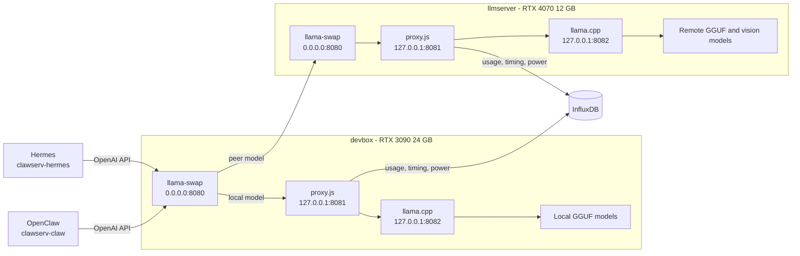

# llama-swap inference architecture

This document defines the inference path from the Hermes and OpenClaw agent
harnesses through llama-swap, the compatibility/telemetry proxy, and llama.cpp.
It also explains model routing, configuration, operations, and adding models.

## System overview



The agent-facing endpoint remains port `8080`. Ports `8081` and `8082` are
loopback-only implementation details.

| Host | Port | Component | Exposure |
| --- | ---: | --- | --- |
| devbox | 8080 | llama-swap front door | LAN |
| devbox | 8081 | proxy.js | loopback |
| devbox | 8082 | llama.cpp selected model | loopback |
| llmserver | 8080 | peer llama-swap | LAN |
| llmserver | 8081 | proxy.js | loopback |
| llmserver | 8082 | llama.cpp selected model | loopback |

## How a harness identifies a model

Hermes and OpenClaw use an OpenAI-compatible provider URL ending in `/v1`.
For chat, the harness sends `POST /v1/chat/completions` with a JSON body:

```json
{
  "model": "qwen36-35b-a3b",
  "messages": [
    { "role": "user", "content": "Hello" }
  ],
  "stream": true
}
```

The `model` string is llama-swap's routing key. Provider names such as Hermes'
`custom:devbox` or OpenClaw's `llama2` are client-side namespaces. They select
an endpoint and catalog entry, but llama-swap routes on the JSON `model` value.

llama-swap resolves the value in this order:

1. A local canonical model ID, which is a key under `models`.
2. A local alias listed under `aliases`.
3. A configured selector or profile, if used.
4. A peer model. `llmserver/qwen3vl-8b` is explicit; `qwen3vl-8b` is accepted
   unqualified when exactly one peer supplies that ID.

If the correct model is not running, llama-swap stops the current model on that
host, runs the matching `cmd`, waits for `checkEndpoint` to return HTTP 200, and
then forwards the original request. `useModelName` controls the model name sent
to llama.cpp when its served alias differs from the routing ID.

## Current harness configuration

Secrets are intentionally omitted here.

### Hermes

Source: `/home/hermes/.hermes/config.yaml` on `clawserv-hermes`.

- Default model: `qwen36-35b-a3b`
- Default provider: `custom:devbox`
- Text base URL: `http://devbox:8080/v1`
- Vision model: `qwen3vl-8b`
- Vision base URL: `http://devbox:8080/v1`
- `coding` alias: `qwen36-27b`

The vision request reaches devbox with `model: qwen3vl-8b`; devbox recognizes it
as a unique llmserver peer model and forwards it to llmserver's llama-swap.

### OpenClaw

Source: `/home/claw/.openclaw/openclaw.json` on `clawserv-claw`.

- Primary model: `qwen36-35b-a3b`
- Primary local base URL: `http://192.168.86.60:8080/v1`
- API mode: `openai-completions`
- The legacy `llama2` provider retains its name but also points to devbox.

OpenClaw provider prefixes organize its model catalog. The provider removes its
own namespace before sending the configured model ID in the HTTP request.

## llama-swap configuration

The active files are:

- `llama-swap/configs/devbox.yaml`
- `llama-swap/configs/llmserver.yaml`

Important fields:

| Field | Purpose and chosen behavior |
| --- | --- |
| `models` | Canonical model IDs and how to start each upstream server |
| `cmd` | Calls the existing host launcher with model ID, port 8082, and loopback binding |
| `proxy` | Sends requests through proxy.js at `http://127.0.0.1:8081` |
| `checkEndpoint` | Uses proxy/llama.cpp `/health` readiness |
| `healthCheckTimeout` | Allows up to 600 seconds for large-model cold starts |
| `aliases` | Preserves harness-facing names without duplicating model definitions |
| `useModelName` | Sends llama.cpp the alias with which it was launched |
| `globalTTL` | `0`; do not unload solely because the model is idle |
| `unloadTimeout` | Allows 60 seconds for a managed model to stop |
| `hooks.on_startup.preload` | Loads the normal warm model after service startup |
| `peers` | Makes llmserver models available through the devbox front door |

Devbox preloads `qwen36-35b`. llmserver preloads `qwen3vl-8b`. Requesting
another model swaps only the GPU host that owns it.

No `matrix` is configured because each host currently runs one model at a time.
A matrix is appropriate only after confirming that multiple selected models fit
concurrently in a host's VRAM. Selectors, profiles, filters, and custom macros
are also deferred until a concrete routing need exists.

## Adding a devbox model

1. Add the model and its exact llama.cpp settings to
   `C:\development\ai\llama.cpp\pre-built\server.ps1`.
2. Add a matching block under `models` in `configs/devbox.yaml`.
3. Use a unique canonical ID. Add harness-friendly names under `aliases`.
4. Set `useModelName` to the `-a` alias used by `server.ps1`.
5. Add the model to Hermes or OpenClaw's catalog if users should select it.
6. Restart the devbox llama-swap task.
7. Confirm the ID appears in `/v1/models`, then send a small completion.

Do not add two models with the same alias. Variants such as MTP models should
retain distinct canonical IDs even when llama.cpp uses the same served alias.

## Adding an llmserver model

1. Add the model to `/home/kevin/llama/server.sh`, including `MODEL_NAMES` and
   every required `M_*` setting.
2. Add a matching block under `models` in `configs/llmserver.yaml`.
3. Add the canonical ID to `peers.llmserver.models` in `configs/devbox.yaml`.
4. Add it to Hermes/OpenClaw's catalog if it should be directly selectable.
5. Restart llmserver's llama-swap, then restart devbox's llama-swap.
6. Test `llmserver/<model-id>` first. Test the unqualified ID after confirming
   no local or second peer model has the same ID.

## Request and swap lifecycle

1. Harness selects provider and model.
2. Harness sends an OpenAI-compatible request containing `model`.
3. Devbox llama-swap resolves the ID locally or to the llmserver peer.
4. The owning llama-swap keeps an already-running match or replaces its current
   managed llama.cpp process.
5. The initial request waits for `/health` during a cold start.
6. proxy.js transforms Ollama-style fields, applies thinking and OpenClaw cron
   compatibility, records usage/timing/power data, and streams the response.
7. llama.cpp performs inference and returns the OpenAI-compatible response.

An unknown model returns a model-routing error rather than choosing an
arbitrary fallback. A peer outage affects that peer's models but not local
devbox models.

## Operations

### Devbox

```powershell
pwsh .\llama-swap\windows\manage.ps1 status
pwsh .\llama-swap\windows\manage.ps1 start
pwsh .\llama-swap\windows\manage.ps1 restart
pwsh .\llama-swap\windows\manage.ps1 stop
Invoke-RestMethod http://127.0.0.1:8080/v1/models
```

Task Scheduler runs `\LocalAI\LlamaProxy` and `\LocalAI\LlamaSwap` at boot and
restarts failures.

### llmserver

```bash
~/llm-stuff/llama-swap/linux/manage.sh status
~/llm-stuff/llama-swap/linux/manage.sh start
~/llm-stuff/llama-swap/linux/manage.sh restart
~/llm-stuff/llama-swap/linux/manage.sh stop
journalctl --user -u llama-proxy -u llama-swap
```

systemd user services restart failures, and user lingering starts them at boot.

## Rollback

Stop the managed task or service pair. Start the existing proxy with its legacy
defaults (`8080 → 8081`) and start the selected llama.cpp model on `8081`.
Harness port `8080` does not change during rollback.
