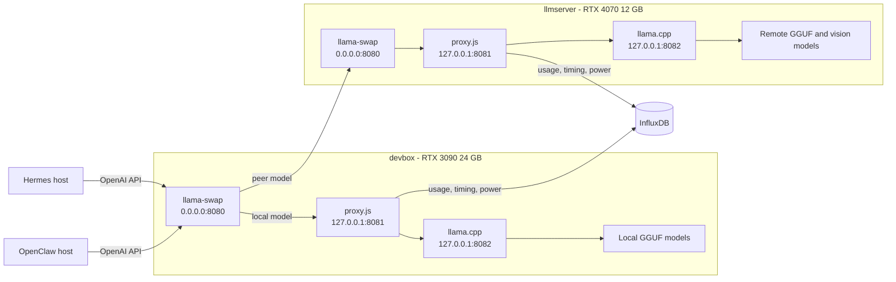

# llama-swap inference architecture

This document defines the inference path from the Hermes and OpenClaw agent
harnesses through llama-swap, the compatibility/telemetry proxy, and llama.cpp.
It also explains model routing, configuration, operations, and adding models.

## System overview



The agent-facing endpoint remains port `8080`. Ports `8081` and `8082` are
loopback-only implementation details.

| Host | Port | Component | Exposure |
| --- | ---: | --- | --- |
| devbox | 8080 | llama-swap front door | LAN |
| devbox | 8081 | proxy.js | loopback |
| devbox | 8082 | llama.cpp selected model | loopback |
| llmserver | 8080 | peer llama-swap | LAN |
| llmserver | 8081 | proxy.js | loopback |
| llmserver | 8082 | llama.cpp selected model | loopback |

## How a harness identifies a model

Hermes and OpenClaw use an OpenAI-compatible provider URL ending in `/v1`.
For chat, the harness sends `POST /v1/chat/completions` with a JSON body:

```json
{
  "model": "qwen36-35b-a3b",
  "messages": [
    { "role": "user", "content": "Hello" }
  ],
  "stream": true
}
```

The `model` string is llama-swap's routing key. Provider names such as Hermes'
`custom:devbox` or OpenClaw's `llama2` are client-side namespaces. They select
an endpoint and catalog entry, but llama-swap routes on the JSON `model` value.

llama-swap does not search the model directories, infer a GGUF filename, or
construct a new llama.cpp command from an arbitrary request. Every accepted
request name must resolve to a configured canonical model, alias, selector, or
advertised peer model. An unknown name is rejected instead of being passed to a
shell command.

llama-swap resolves the value in this order:

1. A local canonical model ID, which is a key under `models`.
2. A local alias listed under `aliases`.
3. A configured selector or profile, if used.
4. A peer model. `llmserver/qwen3vl-8b` is explicit; `qwen3vl-8b` is accepted
   unqualified when exactly one peer supplies that ID.

If the correct model is not running, llama-swap stops the current model on that
host, runs the matching `cmd`, waits for `checkEndpoint` to return HTTP 200, and
then forwards the original request. `useModelName` controls the model name sent
to llama.cpp when its served alias differs from the routing ID.

## Current harness configuration

Secrets are intentionally omitted here.

### Hermes

Source: `$HOME/.hermes/config.yaml` on the Hermes host.

- Default model: `qwen36-35b-a3b`
- Default provider: `custom:devbox`
- Text base URL: `http://devbox:8080/v1`
- Vision model: `qwen3vl-8b`
- Vision base URL: `http://devbox:8080/v1`
- `coding` alias: `qwen36-27b`

The vision request reaches devbox with `model: qwen3vl-8b`; devbox recognizes it
as a unique llmserver peer model and forwards it to llmserver's llama-swap.

### OpenClaw

Source: `$HOME/.openclaw/openclaw.json` on the OpenClaw host.

- Primary model: `qwen36-35b-a3b`
- Primary local base URL: `http://devbox:8080/v1`
- API mode: `openai-completions`
- The legacy `llama2` provider retains its name but also points to devbox.

OpenClaw provider prefixes organize its model catalog. The provider removes its
own namespace before sending the configured model ID in the HTTP request.

## llama-swap configuration

The active files are:

- `llama-swap/configs/devbox.yaml`
- `llama-swap/configs/llmserver.yaml`

Important fields:

| Field | Purpose and chosen behavior |
| --- | --- |
| `models` | Canonical model IDs and how to start each upstream server |
| `cmd` | Calls the existing host launcher with model ID, port 8082, and loopback binding |
| `proxy` | Sends requests through proxy.js at `http://127.0.0.1:8081` |
| `checkEndpoint` | Uses proxy/llama.cpp `/health` readiness |
| `healthCheckTimeout` | Allows up to 600 seconds for large-model cold starts |
| `aliases` | Preserves harness-facing names without duplicating model definitions |
| `useModelName` | Sends llama.cpp the alias with which it was launched |
| `globalTTL` | `0`; do not unload solely because the model is idle |
| `unloadTimeout` | Allows 60 seconds for a managed model to stop |
| `hooks.on_startup.preload` | Loads the normal warm model after service startup |
| `peers` | Makes llmserver models available through the devbox front door |

Devbox preloads `qwen36-35b`. llmserver preloads `qwen3vl-8b`. Requesting
another model swaps only the GPU host that owns it.

### Where llama.cpp settings come from

llama-swap owns the lifetime of llama.cpp, but the existing server launchers
remain the source of truth for its model-specific settings:

- Devbox `cmd` entries call
  `C:\development\ai\llama.cpp\pre-built\server.ps1` with `-Build`, `-Model`,
  `-Port 8082`, and `-ListenHost 127.0.0.1`.
- llmserver `cmd` entries call the repository wrapper
  `llama-swap/linux/start-model.sh` with `--model`, `--port 8082`, and
  `--host 127.0.0.1`. The wrapper resolves the host-neutral `$HOME` path and
  executes `$HOME/llama/server.sh`.

The selected script expands the model ID into its existing model path, context,
batch, GPU, alias, vision/mmproj, speculative-decoding, and other llama.cpp
arguments. llama-swap does not duplicate those settings in YAML. Its `cmd`
only selects the script entry and forces the internal port and loopback bind.
Changing a script's settings therefore changes the next launch of that model;
restart the owning llama-swap to apply the change immediately.

No `matrix` is configured because each host currently runs one model at a time.
A matrix is appropriate only after confirming that multiple selected models fit
concurrently in a host's VRAM. Selectors, profiles, filters, and custom macros
are also deferred until a concrete routing need exists.

## Adding a devbox model

1. Add the model and its exact llama.cpp settings to
   `C:\development\ai\llama.cpp\pre-built\server.ps1`.
2. Add a matching block under `models` in `configs/devbox.yaml`.
3. Use a unique canonical ID. Add harness-friendly names under `aliases`.
4. Set `useModelName` to the `-a` alias used by `server.ps1`.
5. Add the model to Hermes or OpenClaw's catalog if users should select it.
6. Restart the devbox llama-swap task.
7. Confirm the ID appears in `/v1/models`, then send a small completion.

Do not add two models with the same alias. Variants such as MTP models should
retain distinct canonical IDs even when llama.cpp uses the same served alias.

## Adding an llmserver model

1. Add the model to `$HOME/llama/server.sh`, including `MODEL_NAMES` and
   every required `M_*` setting.
2. Add a matching block under `models` in `configs/llmserver.yaml`.
3. Add the canonical ID to `peers.llmserver.models` in `configs/devbox.yaml`.
4. Add it to Hermes/OpenClaw's catalog if it should be directly selectable.
5. Restart llmserver's llama-swap, then restart devbox's llama-swap.
6. Test `llmserver/<model-id>` first. Test the unqualified ID after confirming
   no local or second peer model has the same ID.

## Request and swap lifecycle

1. Harness selects provider and model.
2. Harness sends an OpenAI-compatible request containing `model`.
3. Devbox llama-swap resolves the ID locally or to the llmserver peer.
4. The owning llama-swap keeps an already-running match or replaces its current
   managed llama.cpp process.
5. The initial request waits for `/health` during a cold start.
6. proxy.js transforms Ollama-style fields, applies thinking and OpenClaw cron
   compatibility, records usage/timing/power data, and streams the response.
7. llama.cpp performs inference and returns the OpenAI-compatible response.

An unknown model returns a model-routing error rather than choosing an
arbitrary fallback. A peer outage affects that peer's models but not local
devbox models.

## Operations

### Devbox

```powershell
pwsh .\llama-swap\windows\manage.ps1 status
pwsh .\llama-swap\windows\manage.ps1 start
pwsh .\llama-swap\windows\manage.ps1 restart
pwsh .\llama-swap\windows\manage.ps1 stop
Invoke-RestMethod http://127.0.0.1:8080/v1/models
```

Task Scheduler runs `\LocalAI\LlamaProxy` and `\LocalAI\LlamaSwap` at boot and
restarts failures.

### Devbox logs

Task Scheduler output is captured in rotating UTF-8 log files:

- `llama-swap\logs\proxy.log`: proxy request transforms, streaming diagnostics,
  InfluxDB status, and GPU-power messages.
- `llama-swap\logs\llama-swap.log`: llama-swap routing and the stdout/stderr of
  its managed llama.cpp child.

```powershell
# Follow the proxy log
Get-Content .\llama-swap\logs\proxy.log -Tail 100 -Wait

# Follow llama-swap and llama.cpp
Get-Content .\llama-swap\logs\llama-swap.log -Tail 100 -Wait

# Inspect current and rotated files
Get-ChildItem .\llama-swap\logs |
  Select-Object Name,Length,LastWriteTime
```

Each active file rotates at 50 MiB. Five archives (`.1` through `.5`) are
retained, limiting each component to roughly 300 MiB. Rotation occurs inside
the long-running wrapper and does not depend on a task restart.

The management and startup scripts also clean up only recognized managed
processes left on ports `8080`, `8081`, or `8082`. They refuse to terminate an
unexpected port owner.

### llmserver

```bash
~/llm-stuff/llama-swap/linux/manage.sh status
~/llm-stuff/llama-swap/linux/manage.sh start
~/llm-stuff/llama-swap/linux/manage.sh restart
~/llm-stuff/llama-swap/linux/manage.sh stop
```

systemd user services restart failures, and user lingering starts them at boot.

### What to restart after a change

Restarts interrupt in-flight inference. Prefer a quiet period.

| Changed item | Devbox action | llmserver action | Reason |
| --- | --- | --- | --- |
| `proxy.js`, `proxy.ps1`, `proxy.sh`, or Influx environment | Restart proxy; full-stack restart is safest | Restart `llama-proxy.service` | Reload proxy code, arguments, or environment |
| `configs/devbox.yaml` | Restart devbox llama-swap | None | llama-swap reads YAML only at process start |
| `configs/llmserver.yaml` | Restart devbox llama-swap if its peer list changed | Restart `llama-swap.service` | Reload remote definitions and advertised peer catalog |
| `server.ps1` | Restart devbox llama-swap | None | Replace the current managed llama.cpp child |
| `server.sh` | None | Restart `llama-swap.service` | Replace the current managed llama.cpp child |
| Windows task scripts/settings | Re-run `register-tasks.ps1`, then restart stack | None | Refresh Task Scheduler definitions |
| systemd unit files | None | Reinstall/copy units, run `systemctl --user daemon-reload`, then restart | Refresh installed unit definitions |

Devbox full-stack restart:

```powershell
cd C:\development\ai\llm-stuff
pwsh .\llama-swap\windows\manage.ps1 restart
pwsh .\llama-swap\windows\manage.ps1 status
```

Devbox component-only restarts:

```powershell
# proxy.js, proxy.ps1, or Influx environment only
Stop-ScheduledTask -TaskPath '\LocalAI\' -TaskName LlamaProxy
Start-ScheduledTask -TaskPath '\LocalAI\' -TaskName LlamaProxy

# devbox.yaml or server.ps1
Stop-ScheduledTask -TaskPath '\LocalAI\' -TaskName LlamaSwap
Start-ScheduledTask -TaskPath '\LocalAI\' -TaskName LlamaSwap
```

llmserver restarts:

```bash
# Everything
~/llm-stuff/llama-swap/linux/manage.sh restart

# proxy.js, proxy.sh, or env.sh only
systemctl --user restart llama-proxy.service

# llmserver.yaml or server.sh
systemctl --user restart llama-swap.service

systemctl --user is-active llama-proxy.service llama-swap.service
```

After any restart, check `/health`, `/v1/models`, and the applicable logs.
Restart devbox llama-swap after changing the devbox peer list; restarting only
llmserver cannot update devbox's already-loaded peer configuration.

### llmserver logs

Both services write stdout and stderr to the systemd user journal. llama.cpp is
started as a child of llama-swap, so its startup, model-loading, and inference
server output appears under `llama-swap.service`.

```bash
# Follow the full inference stack
journalctl --user -u llama-swap.service -u llama-proxy.service -f

# llama-swap routing plus its managed llama.cpp child
journalctl --user -u llama-swap.service -f

# proxy request transforms, streaming diagnostics, and telemetry messages
journalctl --user -u llama-proxy.service -f

# Current boot, most recent 100 entries
journalctl --user -b \
  -u llama-swap.service -u llama-proxy.service -n 100 --no-pager

# Previous boot
journalctl --user -b -1 \
  -u llama-swap.service -u llama-proxy.service --no-pager

# Logs since a specific time
journalctl --user \
  -u llama-swap.service -u llama-proxy.service \
  --since "30 minutes ago" --no-pager
```

Structured request, token, timing, and GPU-power metrics continue to be written
by proxy.js to the InfluxDB `llm` bucket. The journal is the source for process
startup, swap decisions, errors, and request-level diagnostic text.

journald rotates automatically according to the host's
`/etc/systemd/journald.conf` limits and available filesystem space. Inspect the
current usage and effective retention settings with:

```bash
journalctl --disk-usage
systemd-analyze cat-config systemd/journald.conf |
  grep -E '^(SystemMaxUse|SystemKeepFree|SystemMaxFileSize|MaxRetentionSec)='
```

At deployment time llmserver had no explicit size/retention overrides, so
journald's filesystem-based defaults apply. `journalctl --disk-usage` reported
347.5 MiB in active and archived journals.

## File and system-object inventory

### Files created in `llm-stuff`

| File | Purpose |
| --- | --- |
| `llama-swap/ARCHITECTURE.md` | Architecture, routing, configuration, operations, logs, and recovery runbook |
| `llama-swap/configs/devbox.yaml` | Devbox models, aliases, llmserver peer catalog, and startup preload |
| `llama-swap/configs/llmserver.yaml` | llmserver models, launch commands, and vision-model preload |
| `llama-swap/windows/install.ps1` | Verifies the pinned Windows archive checksum and installs `llama-swap.exe` |
| `llama-swap/windows/register-tasks.ps1` | Creates the two boot-time `\LocalAI\` scheduled tasks |
| `llama-swap/windows/start-swap.ps1` | Waits for the proxy, starts devbox llama-swap, and captures its output |
| `llama-swap/windows/manage.ps1` | Starts, stops, restarts, and reports the devbox stack |
| `llama-swap/windows/rotating-log.ps1` | Runs native processes with timestamped bounded logs and cleans recognized orphan processes |
| `llama-swap/linux/install.sh` | Verifies the pinned Linux archive checksum and installs the binary and user units |
| `llama-swap/linux/llama-proxy.service` | systemd user unit for llmserver proxy.js |
| `llama-swap/linux/llama-swap.service` | systemd user unit for llmserver llama-swap and its llama.cpp child |
| `llama-swap/linux/manage.sh` | Starts, stops, restarts, and reports the llmserver stack |
| `llama-swap/linux/start-model.sh` | Resolves `$HOME` privately on llmserver and invokes its existing model launcher |

### Existing repository files modified

| File | Change |
| --- | --- |
| `proxy.js` | Adds configurable listen/backend ports, preserves model IDs for routing, and keeps inspected responses uncompressed |
| `proxy.ps1` | Runs the devbox proxy on loopback port 8081, loads Influx variables, and captures rotating logs |
| `proxy.sh` | Runs the llmserver proxy on loopback port 8081 and loads `env.sh` |
| `proxy.test.js` | Tests model preservation, compatibility transforms, metrics, and port parsing |
| `.gitignore` | Excludes generated devbox service logs |

### Host-local files and objects

| Host/object | Purpose |
| --- | --- |
| `C:\development\ai\llama-swap\llama-swap.exe` | Installed pinned Windows llama-swap binary |
| `$HOME/llama-swap/llama-swap` | Installed pinned Linux llama-swap binary |
| `C:\development\ai\llama.cpp\pre-built\server.ps1` | Existing devbox model catalog; updated for explicit host/port use and absolute model paths |
| `$HOME/llama/server.sh` | Existing llmserver model catalog; updated for explicit host/port use |
| `$HOME/llama/server.sh.pre-llama-swap-20260726` | Pre-change backup of llmserver's launcher |
| `influxdb-env.ps1` on devbox | Uncommitted secret environment loaded by `proxy.ps1` |
| `$HOME/llm-stuff/env.sh` | Uncommitted secret environment loaded by `proxy.sh` |
| `llama-swap/logs/*.log` on devbox | Generated rotating process logs; not committed |
| `~/.config/systemd/user/llama-{proxy,swap}.service` | Installed copies of the llmserver user units |
| `\LocalAI\LlamaProxy` and `\LocalAI\LlamaSwap` | Devbox Task Scheduler objects; boot start and failure restart |
| `$HOME/.hermes/config.yaml` | Hermes provider/model configuration on the Hermes host |
| `$HOME/.openclaw/openclaw.json` | OpenClaw provider/model configuration on the OpenClaw host |

The Influx environment files contain secrets and intentionally remain outside
Git. The generated devbox logs and systemd journal are runtime state, not
configuration.

## Rollback

Stop the managed task or service pair. Start the existing proxy with its legacy
defaults (`8080 → 8081`) and start the selected llama.cpp model on `8081`.
Harness port `8080` does not change during rollback.
